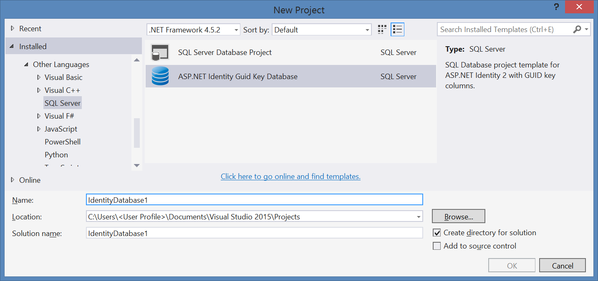

ASP.NET Identity tools for Entity Framework model
================================

> This projects demonstrates how to use [ASP.NET Identity](http://asp.net/identity) with
> Entity Framework data model.

[Getting Started with ASP.NET Identity tools for Entity Framework model](./docs/Entity-Data-Model.md)

### Download

[Visual Studio 2013](https://visualstudiogallery.msdn.microsoft.com/cd93cdd1-97ed-4a57-8aea-5c07c71a294c)

[Visual Studio 2015](https://visualstudiogallery.msdn.microsoft.com/e48464e9-5f10-442a-a6a3-a30117dd5209)

### Authors

 * [Andrii Chebukin](http://www.fb.com/xperiandri) ([xperiandri@outlook.com](mailto:hello@tarkuks.me?subject=ASP.NET+Identity+tools+for+Entity+Framework+model)) - author of improved version
 * [Konstantin Tarkus](https://angel.co/koistya) ([hello@tarkus.me](mailto:hello@tarkuks.me?subject=ASP.NET+Identity+Providers)) - original author

### License

 * **Source code**: the [Apache License 2.0](http://www.apache.org/licenses/LICENSE-2.0) (see [LICENSE.txt](./LICENSE.txt))
 * **Documentation**: the [Creative Commons Attribution 4.0 International License](http://creativecommons.org/licenses/by/4.0/)
